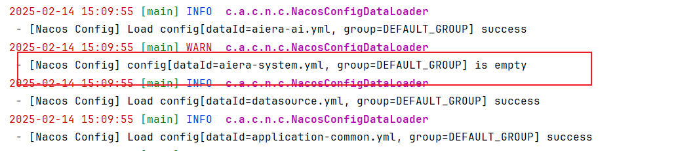

# AI Area（AI 时代）

> AI Area。

## 介绍

此仓库中包含许多AI相关的产品对接示例。
更详细的介绍介绍请参阅每个子项目中的 README.md。

##### 开发环境

语言：Java 17

IDE(JAVA)： IDEA

依赖管理：Maven

缓存：Redis

数据库脚本：MySQL

##### 后端

基础框架：Spring Boot 3.2.5

微服务框架： Spring Cloud Alibaba 2023.0.1

持久层框架：MybatisPlus 3.5.4

安全框架：sa-token 1.37.0

微服务技术栈：Spring Cloud Alibaba、Nacos、Gateway、Sentinel、Skywalking

ai框架：Spring AI

向量数据库：milvus

数据库连接池：hikari

日志打印：logback

其他：autopoi, fastjson，poi，Swagger-ui，quartz, lombok（简化代码）等。

## 项目结构

```text
#### 软件架构
软件架构说明

├─aiera（父POM： 项目依赖、modules组织）  
│   ├─aiera-api（远程api入口）  
│   │   ├─aiera-api-system  
│   ├─aiera-common（通用模块）  
│   │   ├─aiera-common-alibaba-bom   
│   │   ├─aiera-common-bom   
│   │   ├─aiera-common-core  
│   │   └─...  
│   ├─aiera-auth（鉴权模块 端口默认19220）           
│   ├─aiera-gateway（网关模块 端口默认18888）    
│   ├─aiera-modules （业务模块）
│   │   ├─aiera-file （文件业务模块）
│   │   └─aiera-system（系统业务模块：例如各种管理）
│   │   └─aiera-ai（ai模块 端口默认14660）


```

## 快速开始

### 1. 安装docker

请根据当前操作系统类型，安装docker。参考 [docker安装](https://docs.docker.com/get-started/get-docker/)

### 2. 根据需要，修改nacos配置（可选）

修改位置：aiera/pom.xml，找到<profiles>标签并修改里面的nacos相关配置


### 3. 根据docker-compost下载相关镜像文件

```shell
cd docker
docker-compose up -d
```
等待下载完成并完成sql初始化，可访问 http://127.0.0.1:8848/nacos 查看nacos是否启动成功

nacos 登录账号密码 **nacos/nacos@2025**

### 4. 运行程序

运行服务AiEraGatewayApplication

**注意**：若访问接口时出现 未获取到 token 等错误，可以先修改cn.hfstorm.aiera.gateway.filter.AuthFilter或cn.hfstorm.aiera.common.security.config.SecurityConfiguration.getSaServletFilter的拦截路径

若启动时出现nacos未加载配置，可以尝试重新发布一下nacos配置


## 如何参与

我们欢迎任何形式的贡献，包括但不限于：
˜
- Spring AI 的使用示例；
- AI 项目的最佳实践 等。

此项目仓库正在建设中，请阅读 [Roadmap.md](./Roadmap-zh.md) 了解更多信息。
